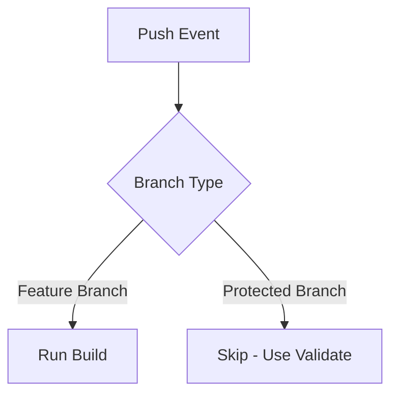
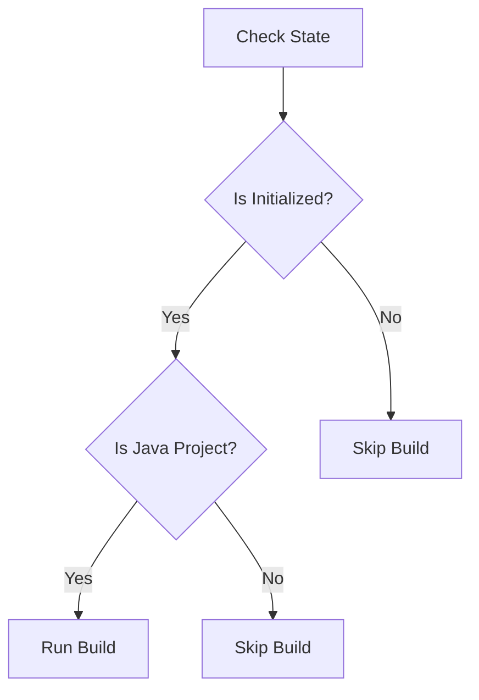
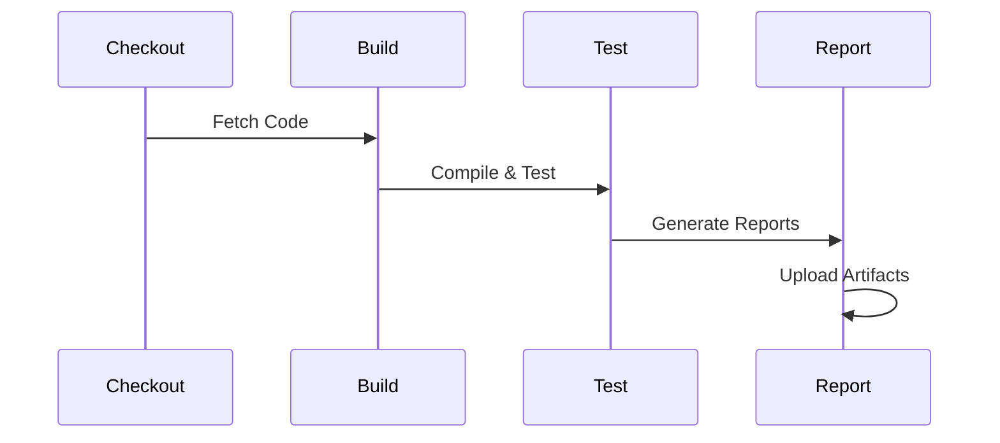
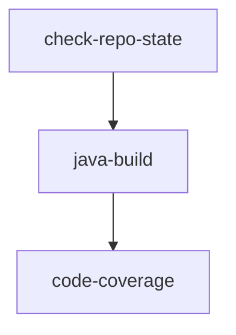

# Build and Test Workflow

The Build and Test workflow (`.github/workflows/build.yml`) automates the build and testing process for feature branches in development. This workflow ensures code quality during active development, before changes are ready for pull requests.

## Overview

The workflow runs automatically on feature branch pushes, providing early feedback on build status and code coverage. It specifically excludes branches that are already covered by the validation workflow (`main`, `fork_integration`, `fork_upstream`).

## How the Build Workflow Works

### Workflow Triggers

The workflow is triggered on:
- Push events to any feature branch
- Explicitly excludes:
  - `main` branch (covered by validation workflow)
  - `fork_integration` branch (covered by validation workflow)
  - `fork_upstream` branch (covered by validation workflow)



### Repository State Check

Before proceeding with the build, the workflow performs initial checks:



1. **Initialization Check**
   - Verifies presence of `pom.xml` or `src` directory
   - Determines if repository is ready for building

2. **Project Type Check**
   - Identifies if the repository is a Java project
   - Enables appropriate build steps

### Build Process

For Java repositories, the workflow executes a comprehensive build process:



1. **Java Build**
   - Compiles the source code
   - Runs unit tests
   - Generates build artifacts
   - Reports build status

2. **Code Coverage**
   - Executes test suite with coverage tracking
   - Generates detailed coverage reports
   - Uploads coverage artifacts
   - Provides coverage summary in workflow

### Artifact Management

The workflow handles build outputs through:

1. **Build Artifacts**
   - JAR files
   - Maven build logs
   - 2-day retention period

2. **Coverage Reports**
   - JaCoCo coverage data
   - HTML reports
   - 2-day retention period

Example Coverage Summary:
```
# Test Coverage Report
## Summary
Instructions: 85% (1234/1452)
Lines: 88% (234/266)
Complexity: 75% (123/164)
```

## Job Dependencies



1. **check-repo-state**
   - Initial repository validation
   - Determines build eligibility

2. **java-build**
   - Main build process
   - Depends on successful state check

3. **code-coverage**
   - Coverage analysis
   - Depends on successful build

## Environment and Caching

The workflow optimizes performance through:

1. **Maven Package Caching**
   - Caches dependencies between runs
   - Excludes local project artifacts
   - Uses hash of `pom.xml` for cache key

2. **Java Environment**
   - Uses Temurin JDK 17
   - Configures Maven settings
   - Sets appropriate environment variables

## Conclusion

The Build and Test workflow provides:
- Rapid feedback for feature development
- Comprehensive build verification
- Detailed code coverage analysis
- Efficient artifact management

This ensures code quality during active development, complementing the validation workflow that handles protected branches and pull requests. 