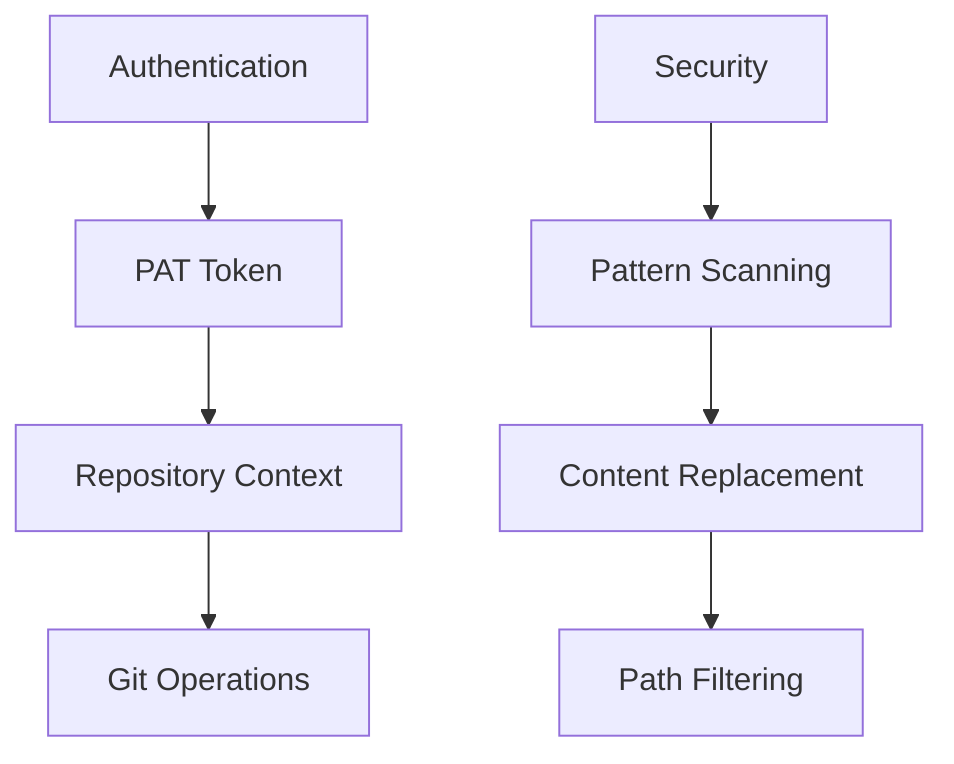
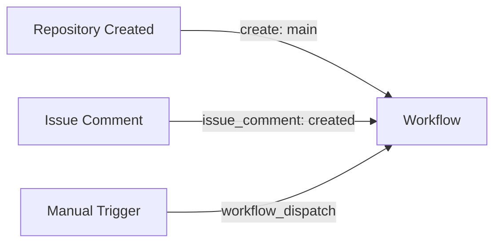
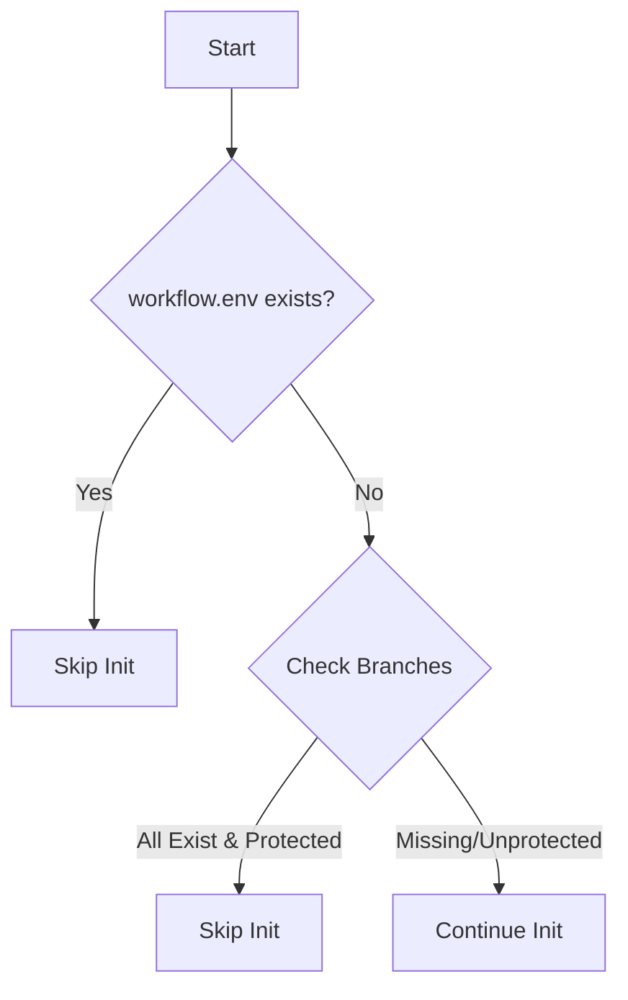
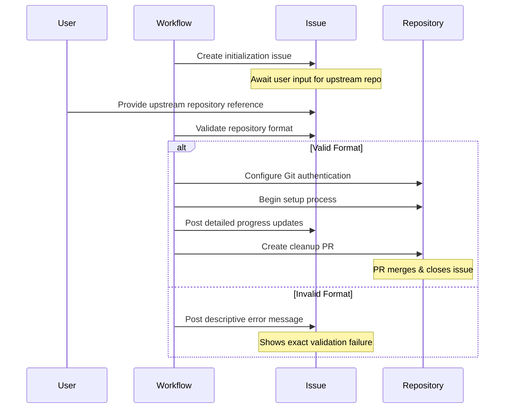
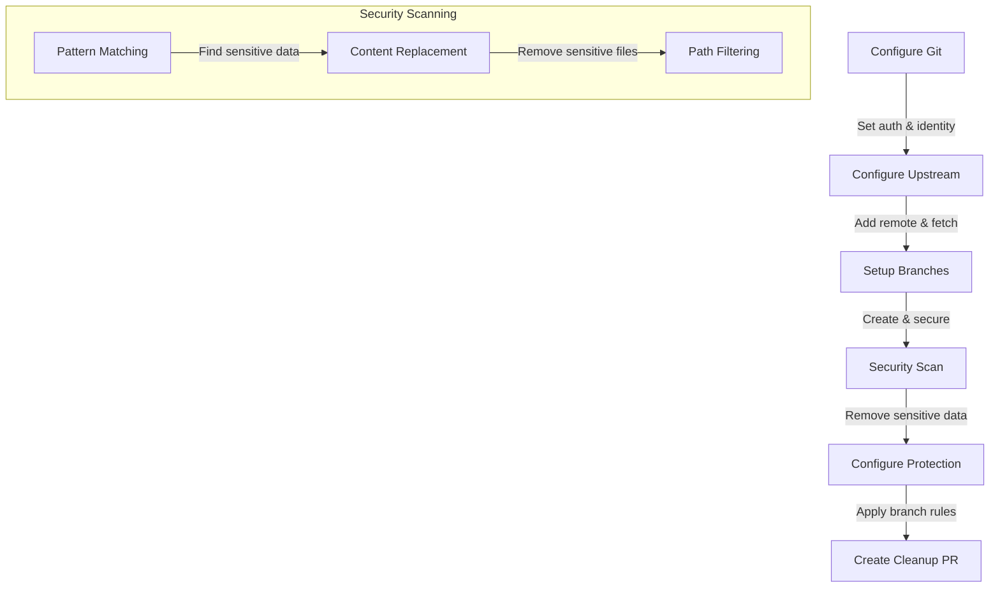
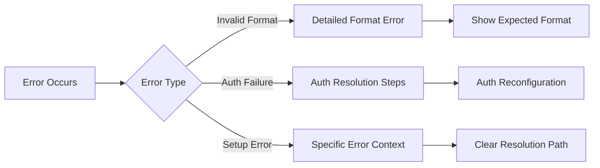
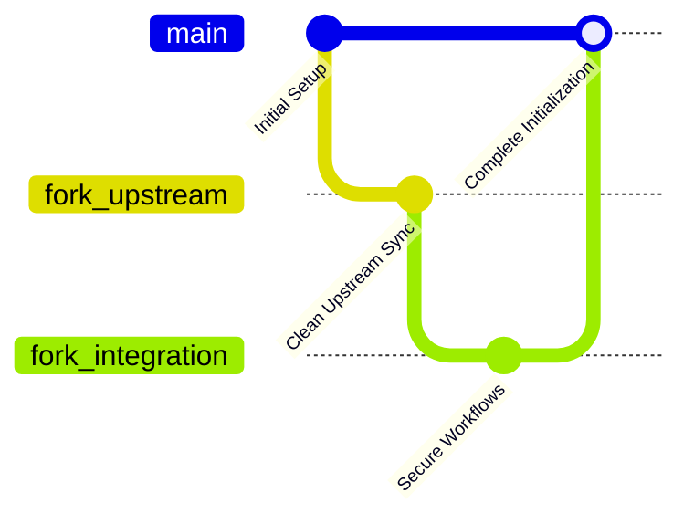

# Fork Management Initialization Workflow

The Initialization Workflow (`.github/workflows/init.yml`) automates the setup of a fork management repository, ensuring proper branch structures, protection rules, and configurations are applied. This workflow streamlines the process of bringing online a fork with its upstream repository while maintaining controlled updates and synchronization.

## Purpose

The goal of this workflow is to:

- Establish the required branch structure for proper upstream synchronization.
- Configure branch protection rules to maintain repository integrity.
- Manage repository setup through automated issue tracking.
- Provide a clean initialization process by handling setup, validation, and cleanup efficiently.
- Ensure secure handling of sensitive data during repository setup.

## Authentication and Security

The workflow uses enhanced authentication mechanisms:



- Uses Personal Access Token (PAT) for authenticated operations
- Maintains repository owner context in Git URLs
- Configures Git with proper authentication settings
- Implements security scanning during branch setup

## How the Workflow is Triggered

The workflow can be triggered through multiple mechanisms:



### Trigger Details

1. Automatic – Runs when a repository is created with the main branch.
2. Issue Comment – Activated when a user provides an upstream repository reference in an issue.
3. Manual – A repository owner can trigger it from GitHub Actions.

## Initialization Process

### 1. Workflow Startup & Validation

The workflow first checks if initialization is necessary by determining:

- If .github/workflow.env exists (indicating prior initialization).
- If required branches (main, fork_upstream, fork_integration) are already present and protected.



### 2. Issue-Based Setup

The workflow manages setup through a structured issue process:



### 3. Repository Configuration

The setup process includes enhanced security and configuration steps:



### 4. Git Configuration and Security

The workflow implements comprehensive Git configuration:

```yaml
# Git Configuration Steps
1. Set user identity
   - name: github-actions[bot]
   - email: github-actions[bot]@users.noreply.github.com

2. Configure authentication
   - Uses PAT token with owner context
   - Secure URL replacement for GitHub operations

3. Security scanning
   - Pattern-based content scanning
   - Sensitive file removal
   - Path-based filtering
```

### 5. Error Handling & Reporting

Enhanced error handling provides clear feedback:



- Uses GitHub Actions error annotations for visibility
- Provides specific error messages with context
- Includes resolution steps in error messages
- Maintains error history in issue comments

### 6. Branch Protection Rules

The workflow enforces comprehensive branch protection:

- Requires status checks to pass
- Enforces linear commit history
- Enables PR review requirements
- Configures branch restrictions
- Sets up security scanning

### 7. Cleanup Process

The cleanup process is thorough and automated:

- Removes initialization-specific files
- Cleans up temporary configurations
- Maintains workflow history
- Creates a documented cleanup PR

## Final Repository Structure



