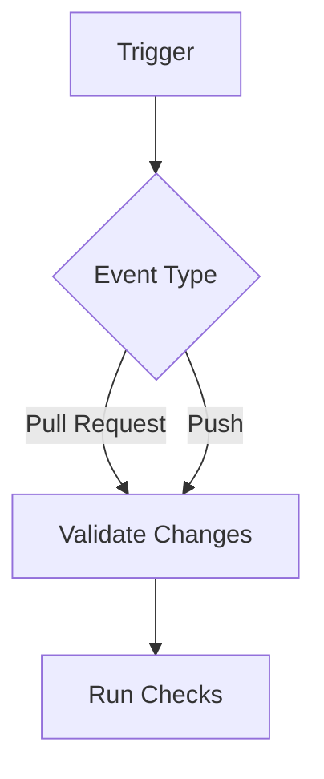
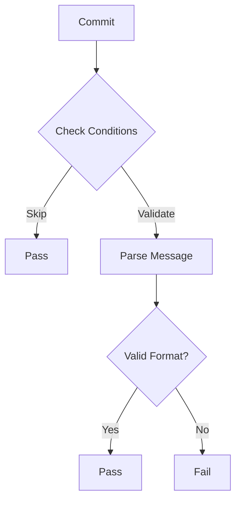
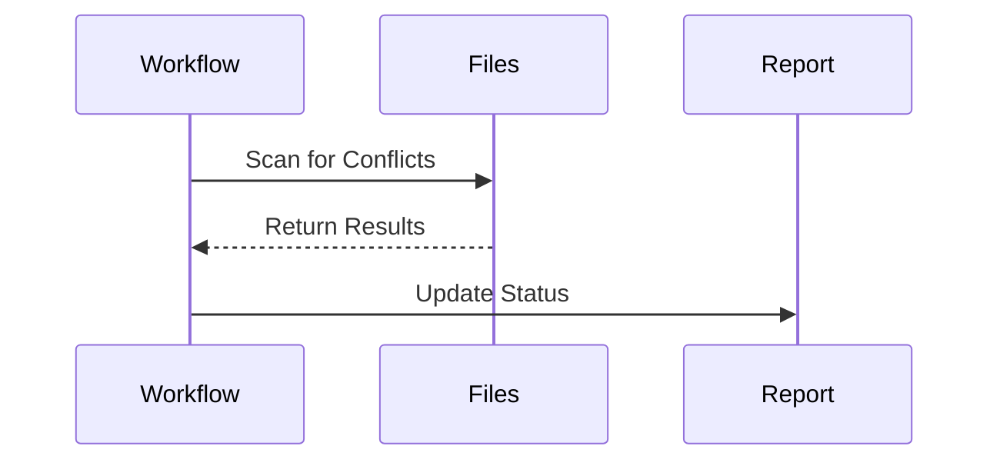
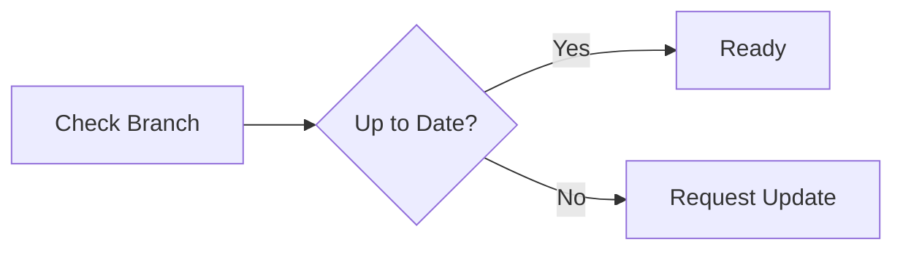

# Validation Workflow

Ensuring code quality and consistency is a crucial part of maintaining a stable and reliable codebase. The validation workflow, defined in `.github/workflows/validate.yml`, automates this process by enforcing commit standards, detecting conflicts, and verifying branch status before allowing code changes to be merged.

## Overview

The validation workflow runs automatically to check the integrity of pull requests and push events. By validating commit messages, detecting conflicts, and ensuring branches are up-to-date, it helps maintain a clean and structured development process.

## How the Validation Workflow Works

### Workflow Triggers

The workflow is triggered in two scenarios:
- **Pull Requests**: When a pull request is opened or updated targeting `main`, `fork_integration`, or `fork_upstream` branches.
- **Push Events**: When a direct push occurs to `main`, `fork_integration`, or `fork_upstream` branches.



### Repository State Check

Before running validations, the workflow checks:
1. If the repository is initialized
2. If it's a Java repository
These checks determine which validations to run.

### Java Build Process

For Java repositories, the workflow:
1. Runs the Java build process
2. Generates code coverage reports (only for pull requests)
3. Uploads build artifacts and coverage reports

### Validation Process Flow

The workflow follows a structured sequence to validate changes:

### 1. Checking Commit Messages

Commit messages must follow the conventional commit format, but only under specific conditions:
- The pull request targets the `main` branch
- The author is not Dependabot
- The branch name doesn't contain 'fork_'
- The PR title doesn't start with 'chore(sync)'

When validated, commits must follow these types:
- **feat**: Introduces new features
- **fix**: Addresses bugs
- **docs**: Documentation updates
- **chore**: Maintenance tasks
- **upstream**: Syncing upstream changes



### 2. Detecting Merge Conflicts

The workflow scans for conflict markers (`<<<<<<`, `=======`, `>>>>>>`) and blocks merges if any are found.



### 3. Verifying Branch Status

Before merging, the workflow checks if the pull request branch is up-to-date with its base branch. If the branch is outdated, an update request is issued.



### 4. Reporting Validation Status

After validation, a status report is posted on the pull request with detailed results, including:
- Repository initialization status
- Java build status (if applicable)
- Conflict check results
- Branch status
- Dependabot-specific status (if applicable)

Example Status Report:
```
## Validation Status
- ✓ No Merge Conflicts
- ✓ Branch is Up-to-date
- ✓ Java Build Successful
- ✓ Repository Initialized

Ready for review!
```

## Conclusion

The validation workflow ensures code quality through:
- Selective commit message validation
- Automated Java builds with coverage reporting
- Conflict detection
- Branch synchronization checks
- Comprehensive status reporting

This process enhances code quality while maintaining flexibility for different types of changes and automated processes.
